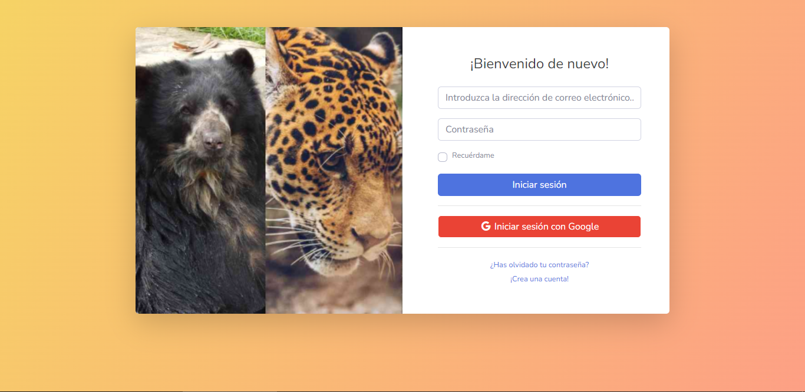

# Aplicativo-Web-Flask-Green-Project
Aplicación web para la asignatura de Proyecto informático.

El proyecto consiste en el desarrollo de una plataforma web, que surge como iniciativa para fomentar y apoyar proyectos ambientales. Esta permitirá exponer ideas y proyectos ambientales y culturales, y facilitará el apoyo y la colaboración de las personas para que se lleven a cabo estos proyectos.

# Imagenes de demostración
 
**Principal:**
 

  

  

 
**Registro y Login**
 

  

  

  

 
**Proponente**
 

  

  

  

  

